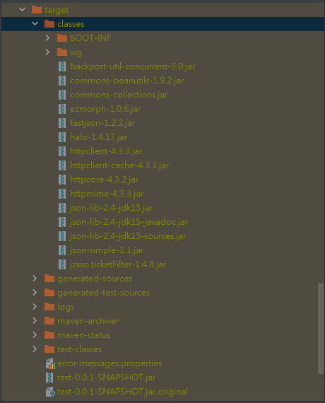
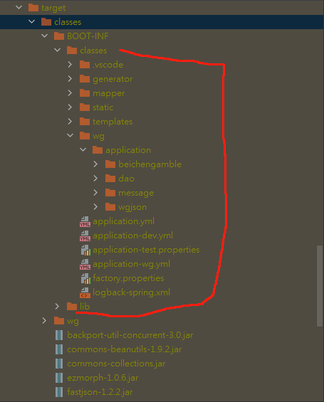
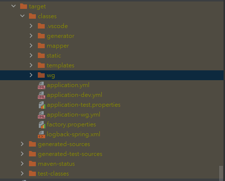

 bugs:

### 1: mapper 找不到 ==> 不使用@Repository 注解,改使用 @Mapper注解

```java
required a bean of type 'com.example.datawash.dao.TestDaoWordbook' that could not be found.
```

解决方案:

​	使用 @Mapper 注解

2. 启动类加

3. ```java
   java.lang.annotation.AnnotationFormatError: Invalid default: public abstract java.lang.Class org.mybatis.spring.annotation.MapperScan.factoryBean()
   ```

   版本问题,

4. 缺少 spring.starter包

   ```java
    		<dependency>
               <groupId>org.mybatis.spring.boot</groupId>
               <artifactId>mybatis-spring-boot-starter</artifactId>
               <version>2.1.1</version>
           </dependency>
   ```

   


### 2: 报警告 如下 mysql 的 异常

```tex
Wed Dec 11 11:13:39 CST 2019 WARN: Establishing SSL connection without server's identity verification is not recommended. According to MySQL 5.5.45+, 5.6.26+ and 5.7.6+ requirements SSL connection must be established by default if explicit option isn't se
```

解决: dbproperties.xml 中

```xml
spring.datasource.url = jdbc:mysql://localhost:3306/data_wash?useUnicode=true&characterEncoding=utf-8&useSSL=false
```

### 3: arraylist.contains() 空针异常

解决: <span style="color: red">逻辑有问题</span>


### 4: 不能加载bean  问题 11 是另一种情况

```java
org.springframework.beans.factory.UnsatisfiedDependencyException: Error creating bean with name 'testController':
```

解决: jeecg 配置类的问题, 它指定了包扫描 路径;


解决2:  去掉这个注解, 这个注解的作用是 即禁止 **SpringBoot** 自动注入数据源配置, 

> ```
> // @EnableAutoConfiguration(exclude={DataSourceAutoConfiguration.class})
> ```


### 5: org.apache.shiro.authc.AuthenticationException: Token失效，请重新登录

解决: 

### 6: Oracle "ORA-00942: 表或视图不存在 "

解决: Oracle 是大小写敏感的，但是 Oracle 同样支持”” 语法，将表名或字段名加上”“后，Oracle不会将其转换成大写


### 7: mybatis的一个bug

```java
org.apache.ibatis.exceptions.TooManyResultsException: Expected one result (or null) to be returned by selectOne(), but found: 26
```

 解决 : 结果集为空, 数据库表里没有对应的字段;


### 8: 标识符无效(oracle)

解决: oracle 大小写敏感,mybatis 在 转换时,会把列名转成 大写,但是 oracle里 表的字段名 如果是小写的话,oracle就识别不了, 

### 9: navicat 能查询,plsql不能

解决 : 当oracle数据表字段为小写时,必须使用引号("")将SQL中的列名包裹才能正确执行SQL语句.

### 10 :  mybatis

```java
org.apache.ibatis.binding.BindingException: Invalid bound statement (not found): com.example.datawash.dao.WordbookMapper.examineWordbookAll
```

解决 : 

1. 第一种情况: 绑定问题, mapper.xml 中 id对应 的 sql语句 在 dao层中 未找到映射,xml中 有id 的 sql语句,在 dao层中 必须有对应的映射

2. 第二种情况: 如果你把xml放到了resources文件下，那么就只需要配置mybatis.mapper-locations=classpath:*/mapper/*.xml 就可以了，因为构建的时候会把resources里的东西自动拉到classpath下，注意.classpath意思就是编译后target文件夹下的classes目录.在application.properties 里加

```xml
mybatis.mapper-locations=classpath:mapper/*.xml
```


### 11 : @Mapper  @Repository 都加载不到 dao层 bean

解决 : 自定义一个 配置类 , 自己加载 bean

```java
@Configuration
@ComponentScan(value = "org.jeecg.modules.datawash", includeFilters = {
  @ComponentScan.Filter(type = FilterType.ANNOTATION, classes = {Mapper.class})})
public class DaoConfiguration {

    @Bean
    public WordbookMapper invokeImpController() {


        return new WordbookMapper(){

            @Override
            public List<Wordbook> examineWordbookAll() {
                return null;
            }

            @Override
            public List<MatchingToWordbook> examineMatchingToWordbook() {
                return null;
            }

            @Override
            public int insertBankFlow(HashMap<String, Object> hashMap) {
                return 0;
            }

            @Override
            public String examineWordbookFieldNameByType(Integer type) {
                return null;
            }

            @Override
            public String examineWordbookFieldCodeByType(Integer type) {
                return null;
            }
        };
    }
}
```

 

### 12  : springboot 使用thymeleaf 动态页面
跳转静态页面需要经过controller层才能实现跳转 (不经过静态资源报错)
否则 报 No mapping for GET错误

```java
No mapping for GET /index.html  springboot
```

### 13 . controller 重名

```java
unmapped spring configuration files found
non-compatible bean definition of same name and class 
```


### 14.mysql 时区问题

```sql
set global time_zone = '+8:00';
set time_zone = '+8:00';
flush privileges;
```


### 15: mysql 

​		使用navicat 连接 mysql 时 报

```java
**caching_sha2_password**
```

​		解决:

```java
ALTER USER 'root'@'localhost' IDENTIFIED WITH mysql_native_password BY '123456';
```


### 16: idea 加载不了 项目 

```java
Unable to import maven project:see logs
```

​		解决:

​		maven版本过高,高于 idea 能承受的版本 

### 17: log 报红

​		解决: 安装lombok 插件

### 18: idea链接mysql 连接不上, 

```java
Connection to sj_lstj@localhost failed.
[08001] Could not create connection to database server. Attempted reconnect 3 times. Giving up.

```

  	解决: 在url后加 

```java
?serverTimezone=gmt
```


#### 19: git 在commit 之后 没有添加注释 (没有 -m "") 报

```java
: src refspec master does not match any
```


### 20: 系统问题

```java
yarn : 无法加载文件 d:\node_global\yarn.ps1,因为在此系统上禁止运行脚本。有关
```

​	解决:

​	管理员 运行powshell

​	执行

```java
PS C:\Users\Administrator> set-ExecutionPolicy RemoteSigned

执行策略更改
执行策略可帮助你防止执行不信任的脚本。更改执行策略可能会产生安全风险，如 https:/go.microsoft.com/fwlink/?LinkID=135170
中的 about_Execution_Policies 帮助主题所述。是否要更改执行策略?
[Y] 是(Y)  [A] 全是(A)  [N] 否(N)  [L] 全否(L)  [S] 暂停(S)  [?] 帮助 (默认值为“N”): y

```

### 21: git 问题

clone时 仓库要密码

解决: 把密钥加到库里

### 22. 查看MySQL版本号

```sql
select version();	
```

#### 23. spring test 的一个异常

```java
Unable to find a @SpringBootConfiguration, you need to use @ContextConfiguration or @SpringBootTest(classes=...) with your test
```

注解这样写

```java
@SpringBootTest(classes = Application.class)
```

> import javafx.application.Application;																																							


#### 24. mybatis的一个异常,invalid comparison: java.sql.Timestamp and java.lang.String

```java
invalid comparison: java.sql.Timestamp and java.lang.String
```

 解决: 

mybatis 3.3.0中对于时间参数进行比较时的一个bug. 如果拿传入的时间类型参数与空字符串''进行对比判断则会引发异常. 所以在sql中去掉空串判断, 只保留非空判断就正常了																																							

```xml
<if test="changeDate != null and changeDate != '' ">
changedate = #{changeDate},
</if>
```


#### 25. 空指针异常

1. 是因为没有初始化变量;


#### 26. poi文件导出时候的bug

```java
Caused by: com.fasterxml.jackson.databind.exc.MismatchedInputException: Cannot 			    		deserialize instance of `java.util.ArrayList` out of START_OBJECT token

```

解决: 解决不了,前端的问题,

#### 27. poi设置颜色不起作用

解决:  

```java
    CellStyle cellStyle = workbook.createCellStyle();
    cellStyle.setFillForegroundColor(HSSFColor.GOLD.index);
    cellStyle.setFillPattern(CellStyle.SOLID_FOREGROUND);
```


#### 28. SpringBoot 前台页面get不到js,css文件

解决:

```java
@SpringBootApplication
public class TestApplication extends WebMvcConfigurationSupport {

    public static void main(String[] args) {
        SpringApplication.run(TestApplication.class, args);
    }

    /***************************************************
     * 这里配置静态资源文件的路径导包都是默认的直接导入就可以
     * @author: wg
     * @time: 2020/4/20 15:54
     ***************************************************/
    @Override
    protected void addResourceHandlers(ResourceHandlerRegistry registry) {
        registry.addResourceHandler("/static/**")
                .addResourceLocations(ResourceUtils.CLASSPATH_URL_PREFIX + "/static/");
        super.addResourceHandlers(registry);
    }
}
```

**之后, 重启idea**


#### 29. Caused by: java.lang.IllegalArgumentException: invalid comparison: java.util.Date and java.lang.String

这是mybatis 的一个bug,原因是 日期 不能和 空串 比较

```xml
<if test="createTime !=  null">
    CREATE_TIME = #{createTime},
</if>
```


错误示例,看不同 之处

```xml
<if test="createTime != '' and createTime !=  null">
    CREATE_TIME = #{createTime},
</if>
```


#### 30. springboot 集成springboot data redis出错：

```java
org.springframework.beans.factory.NoSuchBeanDefinitionException: No qualifying bean of type 'org.springframework.data.redis.connection.RedisConnectionFactory' available: expected at least 1 bean which qualifies as autowire candidate. Dependency annotations: {@org.springframework.beans.factory.annotation.Autowired(required=true)}
	at org.springframework.beans.factory.support.DefaultListableBeanFactory.raiseNoMatchingBeanFound(DefaultListableBeanFactory.java:1493) ~[spring-beans-4.3.14.RELEASE.jar:4.3.14.RELEASE]
	at org.springframework.beans.factory.support.DefaultListableBeanFactory.doResolveDependency(DefaultListableBeanFactory.java:1104) ~[spring-beans-4.3.14.RELEASE.jar:4.3.14.RELEASE]
	at org.springframework.beans.factory.support.DefaultListableBeanFactory.resolveDependency(DefaultListableBeanFactory.java:1066) ~[spring-beans-4.3.14.RELEASE.jar:4.3.14.RELEASE]
	at org.springframework.beans.factory.annotation.AutowiredAnnotationBeanPostProcessor$AutowiredFieldElement.inject(AutowiredAnnotationBeanPostProcessor.java:585) ~[spring-beans-4.3.14.RELEASE.jar:4.3.14.RELEASE]
	at org.springframework.beans.factory.annotation.InjectionMetadata.inject(InjectionMetadata.java:88) ~[spring-beans-4.3.14.RELEASE.jar:4.3.14.RELEASE]
	at org.springframework.beans.factory.annotation.AutowiredAnnotationBeanPostProcessor.postProcessPropertyValues(AutowiredAnnotationBeanPostProcessor.java:366) ~[spring-beans-4.3.14.RELEASE.jar:4.3.14.RELEASE]
	at org.springframework.beans.factory.support.AbstractAutowireCapableBeanFactory.populateBean(AbstractAutowireCapableBeanFactory.java:1264) ~[spring-beans-4.3.14.RELEASE.jar:4.3.14.RELEASE]
	at org.springframework.beans.factory.support.AbstractAutowireCapableBeanFactory.doCreateBean(AbstractAutowireCapableBeanFactory.java:553) ~[spring-beans-4.3.14.RELEASE.jar:4.3.14.RELEASE]
	at org.springframework.beans.factory.support.AbstractAutowireCapableBeanFactory.createBean(AbstractAutowireCapableBeanFactory.java:483) ~[spring-beans-4.3.14.RELEASE.jar:4.3.14.RELEASE]
	at org.springframework.beans.factory.support.AbstractBeanFactory$1.getObject(AbstractBeanFactory.java:306) ~[spring-beans-4.3.14.RELEASE.jar:4.3.14.RELEASE]
	at org.springframework.beans.factory.support.DefaultSingletonBeanRegistry.getSingleton(DefaultSingletonBeanRegistry.java:230) ~[spring-beans-4.3.14.RELEASE.jar:4.3.14.RELEASE]
	at org.springframework.beans.factory.support.AbstractBeanFactory.doGetBean(AbstractBeanFactory.java:302) ~[spring-beans-4.3.14.RELEASE.jar:4.3.14.RELEASE]
	at org.springframework.beans.factory.support.AbstractBeanFactory.getBean(AbstractBeanFactory.java:197) ~[spring-beans-4.3.14.RELEASE.jar:4.3.14.RELEASE]
	at org.springframework.beans.factory.support.DefaultListableBeanFactory.preInstantiateSingletons(DefaultListableBeanFactory.java:761) ~[spring-beans-4.3.14.RELEASE.jar:4.3.14.RELEASE]
	at org.springframework.context.support.AbstractApplicationContext.finishBeanFactoryInitialization(AbstractApplicationContext.java:867) ~[spring-context-4.3.14.RELEASE.jar:4.3.14.RELEASE]
	at org.springframework.context.support.AbstractApplicationContext.refresh(AbstractApplicationContext.java:543) ~[spring-context-4.3.14.RELEASE.jar:4.3.14.RELEASE]
	at org.springframework.boot.context.embedded.EmbeddedWebApplicationContext.refresh(EmbeddedWebApplicationContext.java:122) ~[spring-boot-1.5.10.RELEASE.jar:1.5.10.RELEASE]
	at org.springframework.boot.SpringApplication.refresh(SpringApplication.java:693) [spring-boot-1.5.10.RELEASE.jar:1.5.10.RELEASE]
	at org.springframework.boot.SpringApplication.refreshContext(SpringApplication.java:360) [spring-boot-1.5.10.RELEASE.jar:1.5.10.RELEASE]
	at org.springframework.boot.SpringApplication.run(SpringApplication.java:303) [spring-boot-1.5.10.RELEASE.jar:1.5.10.RELEASE]
	at org.springframework.boot.SpringApplication.run(SpringApplication.java:1118) [spring-boot-1.5.10.RELEASE.jar:1.5.10.RELEASE]
	at org.springframework.boot.SpringApplication.run(SpringApplication.java:1107) [spring-boot-1.5.10.RELEASE.jar:1.5.10.RELEASE]
	at com.yingda.xsignal.auth.AuthApplication.main(AuthApplication.java:12) [classes/:na]
 
2018-05-30 17:25:00.027 ERROR 16084 --- [           main] o.s.b.d.LoggingFailureAnalysisReporter   : 
 
***************************
APPLICATION FAILED TO START
***************************
 
Description:
 
Field redisConnectionFactory in com.yingda.xsignal.auth.config.AuthorizationServerConfig required a bean of type 'org.springframework.data.redis.connection.RedisConnectionFactory' that could not be found.
 
 
Action:
 
Consider defining a bean of type 'org.springframework.data.redis.connection.RedisConnectionFactory' in your configuration.
```


原因：我们在pom.xml中引入了spring-boot-starter-data-redis却没有引入redis.client

增加redis client依赖即可


#### 31. 程序启动时,不连接数据库

```java
Description:
 
Failed to configure a DataSource: 'url' attribute is not specified and no embedded datasource could be configured.
//无法配置数据库，没有指定url属性，并且无法配置embedded datasource
Reason: Failed to determine a suitable driver class
//原因：无法明确指定正确的驱动类（driver.class）
 
Action:
 
Consider the following:
    If you want an embedded database (H2, HSQL or Derby), please put it on the classpath.
    If you have database settings to be loaded from a particular profile you may need to activate it (no profiles are currently active).
 
//建议：
//如果如果需要加载嵌入式的数据库，请将他放入路径中
//如果有数据库设置需要从指定配置文件中加载，需要调用该配置文件（目前没有活动的配置文件）
 
Process finished with exit code 1
```


解决:

```java
程序入口处:
 
@SpringBootApplication
public class DemoApplication {
 
修改为:
@SpringBootApplication(exclude = DataSourceAutoConfiguration.class)
public class DemoApplication {
```


2. 加入 nacos 后

   


#### 32. springboot 项目 版本 修改后 ,spring-cloud 版本也要做修改,不然不匹配

版本对应关系,参照如下网址:

https://blog.csdn.net/qq_33407429/article/details/104494109


#### 33. .properties 与 .yml  文件的区别

 


#### 34. application.properties

springmvc mybatis 和 springboot mybatis 在配置文件中的写法不一样;

springmvc 是 :

```xml
mybatis.mapper-locations=classpath*:wgcloud/userlogin/mapper/xml/*.xml
```

springboot 是 :

```xml
mybatis.type-aliases-package=wgcloud.userlogin.mapper
```


#### 35. idea : command line is too lang

```java
Command line is too long.shorten command line for
```

Shorten command line : JAR manifest -java -cp classpath.jar classname[args]

在.idea/workspace.xml文件 -> <component name="PropertiesComponent"> 添加一行 ->

<property name = "dynamic.classpath" value= "true"/>


#### 36. bean的循环依赖,Injection of resource dependencies failed(资源依赖项的注入失败)

org.springframework.beans.factory.BeanCreationException: Error creating bean with name 'org.springframework.boot.autoconfigure.admin.SpringApplicationAdminJmxAutoConfiguration': Initialization of bean failed; nested exception is org.springframework.beans.factory.BeanCreationException: Error creating bean with name 'org.springframework.cache.annotation.**ProxyCachingConfiguration**': Initialization of bean failed; nested exception is org.springframework.beans.factory.BeanCreationException: Error creating bean with name 'redisConfig': **Injection of resource dependencies failed;** nested exception is org.springframework.boot.context.properties.**ConfigurationPropertiesBindException**: Error creating bean with name 'spring.redis-org.springframework.boot.autoconfigure.data.redis.RedisProperties': Could not bind properties to 'RedisProperties' : prefix=spring.redis, ignoreInvalidFields=false, ignoreUnknownFields=true; nested exception is java.lang.IllegalStateException: org.springframework.boot.web.servlet.context.AnnotationConfigServletWebServerApplicationContext@6a03bcb1 **has not been refreshed yet**

Caused by: java.lang.IllegalStateException: org.springframework.boot.web.servlet.context.AnnotationConfigServletWebServerApplicationContext@6a03bcb1 has not been refreshed yet


问题描述:

  在controller层 自动注入一个service的bean,然后 一个全局变量 

String id = 这个bean的一个方法的返回值;

```java
@Controller
@RequestMapping(value = "/roleController")
public class RoleController {

    @Autowired
    private UserInfoService userInfoService;

    public String id = userInfoService.getCurrentUser().getId();
}
```


#### 37. java.lang.IllegalStateException: Cannot call sendError() after the response has been committed


```java
	java.lang.IllegalStateException: Cannot call sendError() after the response has been committed
    
    org.springframework.http.converter.HttpMessageNotWritableException: No converter for [class java.util.HashMap] with preset Content-Type 'application/vnd.ms-excel;charset=utf-8'
```


异常原因:

​	首先，利用reponse.getWrite()获得输出流对象，close()之后，这里reponse其实已经提交了。

​	然后，方法回到controller 层，后面还有一句 return ApiResponse.success()，执行之后发现response已经进行已经跳转了，只不过url没有发生改变，并且页面上也不会生成返回的响应数据。所以当执行上面的return代码之后 ，reponse 会提交两次，服务器就不知道该怎么办了，就抛出异常。

解决:

​	第一种: 去掉service层的out.close() 这里不会因为PrintWriter 输出对象没有关闭而占用资源的。

​	第二种: 让 方法返回void

​	第三种: 不调用setResponseHeader(response, fileName); 	


#### 38. Caused by: org.hibernate.AnnotationException: No identifier specified for entity:


在实体类的 id 字段 加 注解 @Id

```java
import javax.persistence.Id;

	@Id
    private String id;
```


#### 39. Caused by: java.lang.IllegalArgumentException: Not a managed type:

在实体类上加

````java
import javax.persistence.Entity;

@Entity
````


#### 40. org.hibernate.LazyInitializationException: could not initialize proxy

-- jpa

用 findById().get()  替代 getOne();

```java
LiuShui one = liuShuiRepository.findById(3l).get();
```


#### 41. Can't resolve 'less-loader'

文件中的style用了less，而项目中未安装less：

```js
npm install --save-dev less-loader less
```


#### 42. 前台请求有数据,后台接收不到

后台加注解

@ResquestBody


#### 43. has been blocked by CORS policy: No 'Access-Control-Allow-Origin' header is present on the requested resource.


火狐: 已拦截跨源请求：同源策略禁止读取位于 http://127.0.0.1:33333/test/tokenTest 的远程资源。（原因：CORS 头缺少 'Access-Control-Allow-Origin'）。


chrome: Access to XMLHttpRequest at 'http://127.0.0.1:33333/test/tokenTest' from origin 'http://localhost:33333' has been blocked by CORS policy: No 'Access-Control-Allow-Origin' header is present on the requested resource.


跨域问题:

1. 'localhost' 不识别 改成域名;

2. ```java
   response.setHeader("Access-Control-Allow-Origin",request.getHeader("Origin"));
   response.setHeader("Access-Control-Allow-Headers",request.getHeader("Access-Control-Request-Headers"));
   ```


#### 44. 前端bug:  This is probably not a problem with npm. There is likely additional logging output above.

解决: 重新  npm install


#### 45. com.mysql.jdbc.exceptions.jdbc4.MySQLSyntaxErrorException:  Specified key was too long; max key length is 1000 bytes


出错的原因:

1. DB engine 是MyIsAm
2. 字符集是 utf8 ,1个utf8=3bytes
3. 最后就是 (100+255)*3>1000 所以报错


#### 46. Invalid character found in the request target. The valid characters are defined in RFC 7230 and RFC 3986


可用于复现的代码

```js
function clickSubmit1() {
                        var values = new Array();
                        $("#mail-content input").each(function () {
                            values.push($(this).val())
                        })

                        var str = ["name", "company", "phone", "content"];

                        var obj = values.reduce(function (result, value, index) {
                            result[str[index]] = value;
                            return result;
                        }, {})

                        $.ajax({
                            url: "http://localhost:15424/ms-mcms/emailController/emailControl",
                            data: JSON.stringify(obj),
                            success: function (res) {

                                console.log("fanhui cheng gong ")
                            },
                            error: function (res) {
                                console.log(" fan hui cuo wu ")
                            }
                        })

                    }
```


#### 47. 'append' called on an object that does not implement interface FormData.


in order to use formdata with jquery you have to set the correct options

```js
$.ajax({
    url : "/function/pro_pic_upload.php",
    type: "POST",
    data : postData,
    processData: false,
    contentType: false,
    success:function(data, textStatus, jqXHR){
        $("#pro_pix img").last().show();
        $("#pro_pix img").first().hide();
        $("#pro_pix h6").text(data);
    },
    error: function(jqXHR, textStatus, errorThrown){
        //if fails     
    }
});
```


### 48. Error:(39, 24) java: 找不到符号
  符号:   方法 setId(int)
  位置: 类型为com.fybdp.discoverer.model.enums.DropdownDto的变量 dropdownDto


解决: lombok 没起作用, 在idea 设置里 解决

setting -> compiler -> annotation processors -> enable annotation processing


### 49. yarn的一个error:  The engine "yarn" is incompatible with this module. Expected version ">=1.0.0".


执行:

```html
 yarn config set ignore-engines true
```


## 50. jar must specify an absolute path but is /${env.ANDROID_HOME}/platforms/android-22/android.jar in com.google.zxing:core:3.3.3


解决:   在 zxing 的 parent 下的.pom 里 有提示

新建一个 android.jar 空文件 , 把这个文件的全路径 

把

> \<systemPath>/${env.ANDROID_HOME}/platforms/android-${android.platform}/android.jar</systemPath>


替换为:

>  \<systemPath>D:\apache-maven-3.5.4\maven-repository\com\google\zxing\zxing-parent\3.3.3/android.jar</systemPath>


# 51. 前端报错 net::ERR_ABORTED 404


解决: maven -> Lifecycle -> clean


# 52.   yml 文件报字符集问题   java.nio.charset.MalformedInputException: Input length = 1


解决1: 把 中文注释删掉

解决2:  先猜测原因 -> 我的是因为新电脑, 没有notepad 或 sublime , 它的打开方式默认是微软的记事本, 你懂的

​		解决: 用notepad 转一下格式 , 转成utf-8 保存


# 53. 20210906 一个神奇的bug:  显示在前端时一个空格, 后台显示2个空格


主要是浏览器默认只认同字符中间的一个空格，其他忽略掉。

```
<pre></pre>标记

<xmp></xmp>标记
```


用以上两个标记包裹住你需要浏览器按照你的预编排的格式输出的内容，这样就可以解决这个问题了


# 54.  同一个包内, @requestmapping 不能有相同的value

```java
Caused by: java.lang.IllegalStateException: Ambiguous mapping. Cannot map 'riskAssessmentSectionInputController' method 
com.sevenme.pipelinemanager.offshorepipeline.controller.RiskAssessmentSectionInputController#list(Map)
to {GET /api/offshorepipeline/list}: There is already 'riskAssessmentHistoryController' bean method
com.sevenme.pipelinemanager.offshorepipeline.controller.RiskAssessmentHistoryController#list(Map) mapped.
```


# 55. 关于练习中一个关于线程的bug

bug描述: 龟兔赛跑问题, 公司电脑上(联想 amd cpu 笔记本), 在debug的时候, 程序能正常停止, 但在run 的时候, 停止不了; 

在自己电脑上(acer intel cpu 台式机), 都可以正常停止;


# 56. trim

trim 的时候 会 空指针


# 57.  to absolute file path because it does not reside in the file system

通过`ClassPathResource`获取resources目录中的模板文件时，直接`resource.getFile()`获取，从而导致报错

原因是项目构建成jar的形式之后，resources目录中的文件并不是直接存在系统中，而是嵌套在jar文件中


 解决:  使用 FileUtils.copyInputStreamToFile(classPathResource.getInputStream(), file);

```java
 public static Properties getProperties(ClassPathResource classPathResource) {
        Properties properties = new Properties();
        try {
            File file = File.createTempFile(classPathResource.getFilename(), null);
            // File file = new File("./" + classPathResource.getFilename());
            FileUtils.copyInputStreamToFile(classPathResource.getInputStream(), file);
            BufferedReader bufferedReader = new BufferedReader(new FileReader(file));
            properties.load(bufferedReader);
            return properties;
        } catch (IOException e) {
            e.printStackTrace();
        }
        return null;
    }
```


测试

```java
package wg.application.message;

import org.springframework.core.io.ClassPathResource;
import org.springframework.web.bind.annotation.GetMapping;
import org.springframework.web.bind.annotation.RequestMapping;
import org.springframework.web.bind.annotation.RestController;
import wg.application.util.CommonUtil;

import java.util.Properties;

@RestController
@RequestMapping(value = "error_message")
public class ErrorMessageOfApp {

    @GetMapping(value = "/get")
    public Properties get() {
        String path = "wg/application/message/error-messages.properties";
        ClassPathResource pathResource = new ClassPathResource(path);

        System.out.println(pathResource.getPath());
        System.out.println(pathResource.getFilename());


        return CommonUtil.getProperties(pathResource);
    }

}

```


```java
    @Test
    public void getErrorMessage(){
        ErrorMessageOfApp message = new ErrorMessageOfApp();
        Properties properties = message.get();

        System.out.println(properties);
    }
    
```


另外 : 

```xml
        <resources>
            <resource>
                <directory>src/main/resources</directory>
                <targetPath>BOOT-INF/classes/</targetPath>
            </resource>

            <!--因为默认java包即源码包下面的xml文件不会被编译，如果想要编译加上如下代码-->
            <resource>
                <directory>src/main/java</directory>
                <targetPath>BOOT-INF/classes/</targetPath>
                <includes>
                    <include>**/*.xml</include>
                    <include>**/*.properties</include>
                    <include>**/*.json</include>
                </includes>
            </resource>
            
        </resources>

```


如果 加入 这一行  <targetPath>BOOT-INF/classes/</targetPath>

在单元测试时, 会报错, 而且 连配置文件都读不到了

但是, 当使用 java -jar 运行时, 都没问题, 一切正常, 配置文件也能读到

看一下 打包后 目录结构








 不加   <targetPath>BOOT-INF/classes/</targetPath> 项目目录是 这样的




  所以, 静态文件尽量放在 static 下面


# 58. java -jar 形式 能运行, 但 idea 运行不了, 提示 没有 datasource url 属性

 重启 idea


# 59. druid bug

druid 链接问题

问题: 

```
com.alibaba.druid.pool.DruidDataSource   : create connection SQLException, url: 
```


解决:  在问号后, 加些参数

```
spring: 
  datasource:
    url: jdbc:mysql://192.168.12.240:13401/ci_dp_peq_strategy_asset?characterEncoding=UTF-8&useSSL=false&tinyInt1isBit=false&allowPublicKeyRetrieval=true&useUnicode=true&serverTimezone=GMT%2B8&autoReconnect=true&zeroDateTimeBehavior=convertToNull&allowMultiQueries=true

这是一段 JDBC 数据库连接参数设置的字符串，用于在应用程序中连接 MySQL 数据库。各参数含义如下：

characterEncoding=UTF-8：使用 UTF-8 字符编码集处理数据。
useSSL=false：禁用 SSL 加密传输。
tinyInt1isBit=false：将 TINYINT 类型字段视为 int 类型而非 boolean 类型。
allowPublicKeyRetrieval=true：允许从服务器获取 public key，可以使用一些加密算法实现更安全的连接。
useUnicode=true：使用 Unicode 格式处理数据。
serverTimezone=GMT+8：设置数据库时区为东八区，也就是北京时间。
autoReconnect=true：自动重连数据库以保持连接不断开。
zeroDateTimeBehavior=convertToNull：当数据库中 DATETIME 或 DATE 字段值为 0000-00-00 00:00:00 时，转换为 null 值。
allowMultiQueries=true：允许执行多个查询语句，以便提高效率。
通过正确配置这些参数，可以建立稳定、高效的数据库连接，并保证应用程序的运行质量与安全性。
```

